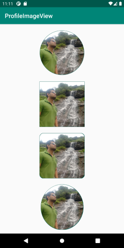

# ProfileImageView

   

most frequently and useful profile view in Android


## Features
- Single view with multiple shapes
- Border for each view
- light weight and fast loaded

## How to integrate the library in your app?
Step 1: Add it in your root build.gradle at the end of repositories:

```
allprojects {
    repositories {
        maven { url "https://jitpack.io" }
    }
}
```
Step 2. Add the dependency

```
dependencies {
    implementation 'com.github.pankajmuneshwar:ProfileView:Tag'
}
```
Step 3. Add CurveGraphView to your layout file

```
 <com.genie.profileimageview.ProfileImage
    android:id="@+id/circularProfileImageView"
    android:layout_width="150dp"
    android:layout_height="150dp"
    android:src="@drawable/profile"
    android:layout_marginTop="20dp"
    app:shape="circle"
    app:borderSize="2"
    app:borderColor="@color/colorPrimaryDark"
    app:layout_constraintTop_toTopOf="parent"
    app:layout_constraintStart_toStartOf="parent"
    app:layout_constraintEnd_toEndOf="parent"/>

```

## How to customize the view.

1) If you want to add border then only add app:borderSize=“2” 
2) Border size can be change as per requirements
3) Border colour can be change app:borderColor="@color/colorPrimaryDark" 

# Can have multiple shapes
1) app:shape="circle"
2) app:shape="Square"
3) app:shape="Rounded Corner"
4) app:shape="oval"
